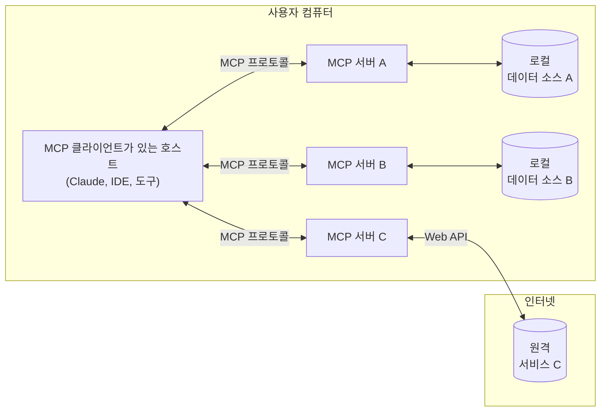

# 소개

> Model Context Protocol (MCP) 시작하기

MCP는 애플리케이션이 LLM에 컨텍스트를 제공하는 방법을 표준화하는 개방형 프로토콜입니다. MCP를 AI 애플리케이션을 위한 USB-C 포트라고 생각해보세요. USB-C가 다양한 주변기기와 액세서리를 연결하는 표준화된 방법을 제공하는 것처럼, MCP는 AI 모델을 다양한 데이터 소스와 도구에 연결하는 표준화된 방법을 제공합니다.

## 왜 MCP인가?

MCP는 LLM 위에 에이전트와 복잡한 워크플로우를 구축하는 데 도움을 줍니다. LLM은 자주 데이터와 도구와 통합해야 하며, MCP는 다음을 제공합니다:

* LLM이 직접 연결할 수 있는 사전 구축된 통합 목록의 지속적인 확장
* LLM 공급자와 벤더 간 전환의 유연성
* 인프라 내에서 데이터를 보호하기 위한 모범 사례

### 일반 아키텍처

핵심적으로 MCP는 호스트 애플리케이션이 여러 서버에 연결할 수 있는 클라이언트-서버 아키텍처를 따릅니다:

* **MCP 호스트**: MCP를 통해 데이터에 액세스하려는 Claude Desktop, IDE 또는 AI 도구와 같은 프로그램
* **MCP 클라이언트**: 서버와 1:1 연결을 유지하는 프로토콜 클라이언트
* **MCP 서버**: 표준화된 Model Context Protocol을 통해 특정 기능을 노출하는 경량 프로그램
* **로컬 데이터 소스**: MCP 서버가 안전하게 액세스할 수 있는 컴퓨터의 파일, 데이터베이스 및 서비스
* **원격 서비스**: MCP 서버가 연결할 수 있는 인터넷을 통해 사용 가능한 외부 시스템(예: API를 통해)

## 시작하기

필요에 가장 적합한 경로를 선택하세요:

### 빠른 시작

#### 서버 개발자를 위한 가이드
Claude for Desktop 및 기타 클라이언트에서 사용할 자체 서버 구축 시작하기
[서버 빠른 시작 가이드 →](/quickstart/server)

#### 클라이언트 개발자를 위한 가이드
모든 MCP 서버와 통합할 수 있는 자체 클라이언트 구축 시작하기
[클라이언트 빠른 시작 가이드 →](/quickstart/client)

#### Claude Desktop 사용자를 위한 가이드
Claude for Desktop에서 사전 구축된 서버 사용 시작하기
[사용자 빠른 시작 가이드 →](/quickstart/user)

### 예제

#### 예제 서버
공식 MCP 서버 및 구현 갤러리 확인하기
[예제 서버 →](/examples)

#### 예제 클라이언트
MCP 통합을 지원하는 클라이언트 목록 보기
[예제 클라이언트 →](/clients)

## 튜토리얼

#### LLM으로 MCP 구축하기
Claude와 같은 LLM을 사용하여 MCP 개발 속도를 높이는 방법 배우기
[튜토리얼 보기 →](/tutorials/building-mcp-with-llms)

#### 디버깅 가이드
MCP 서버와 통합을 효과적으로 디버그하는 방법 배우기
[디버깅 가이드 →](/docs/tools/debugging)

#### MCP Inspector
대화형 디버깅 도구로 MCP 서버 테스트 및 검사하기
[MCP Inspector →](/docs/tools/inspector)

#### MCP 워크샵 (비디오, 2시간)
[YouTube에서 보기](https://www.youtube.com/watch?v=kQmXtrmQ5Zg)

## MCP 탐색하기

MCP의 핵심 개념과 기능을 더 깊이 알아보세요:

#### 핵심 아키텍처
MCP가 클라이언트, 서버 및 LLM을 연결하는 방법 이해하기
[아키텍처 문서 →](/docs/concepts/architecture)

#### 리소스
서버에서 LLM으로 데이터와 콘텐츠 노출하기
[리소스 문서 →](/docs/concepts/resources)

#### 프롬프트
재사용 가능한 프롬프트 템플릿과 워크플로우 만들기
[프롬프트 문서 →](/docs/concepts/prompts)

#### 도구
서버를 통해 LLM이 작업을 수행할 수 있도록 하기
[도구 문서 →](/docs/concepts/tools)

#### 샘플링
서버가 LLM에서 완성을 요청할 수 있도록 하기
[샘플링 문서 →](/docs/concepts/sampling)

#### 전송
MCP의 통신 메커니즘에 대해 알아보기
[전송 문서 →](/docs/concepts/transports)

## 기여하기

기여하고 싶으신가요? [기여 가이드](/development/contributing)를 확인하여 MCP 개선에 도움을 줄 수 있는 방법을 알아보세요.

## 지원 및 피드백

다음은 도움을 받거나 피드백을 제공하는 방법입니다:

* MCP 사양, SDK 또는 문서(오픈 소스)와 관련된 버그 보고서 및 기능 요청은 [GitHub 이슈 생성](https://github.com/modelcontextprotocol)을 통해 해주세요
* MCP 사양에 대한 토론이나 Q&A는 [사양 토론](https://github.com/modelcontextprotocol/specification/discussions)을 사용하세요
* 기타 MCP 오픈 소스 구성 요소에 대한 토론이나 Q&A는 [조직 토론](https://github.com/orgs/modelcontextprotocol/discussions)을 사용하세요
* Claude.app 및 claude.ai의 MCP 통합과 관련된 버그 보고서, 기능 요청 및 질문은 Anthropic의 [지원 받는 방법](https://support.anthropic.com/en/articles/9015913-how-to-get-support) 가이드를 참조하세요